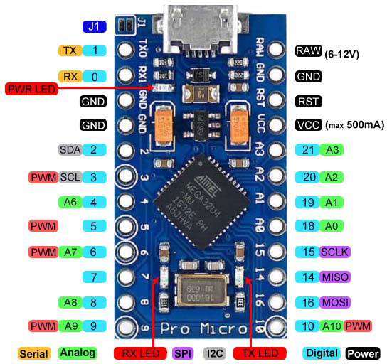

# BadUSB-ArduinoProMicro
💀 HID-based BadUSB payload for Windows using Arduino Pro Micro (ATmega32u4) to emulate keyboard input and execute scripted commands like opening PowerShell, downloading files, or modifying system settings.

# !!! PROJECT NOT FINISHED YET !!!

This project is still under development. In the future, code examples, documentation, and more advanced features will be added.

    > Arduino Pro Micro <

  

  
    

### LEGAL DISCLAIMER PLEASE READ!
##### I, the creator and all those associated with the development and production of this program are not responsible for any actions and or damages caused by this software. You bear the full responsibility of your actions and acknowledge that this software was created for educational purposes only. This software's intended purpose is NOT to be used maliciously, or on any system that you do not have own or have explicit permission to operate and use this program on. By using this software, you automatically agree to the above.

# :moneybag: Donate:
**BTC:** `bc1q5exw2v9sa0yktp2t7xnq8ma2xpn5a29s7w283y`  
**ETH:** `0x8d797249170d263B959A3c688D8456adBcfBC319`  
**XMRT:** `0xF978FE35d00A201eB48aB3908993e14f312001a2`  
